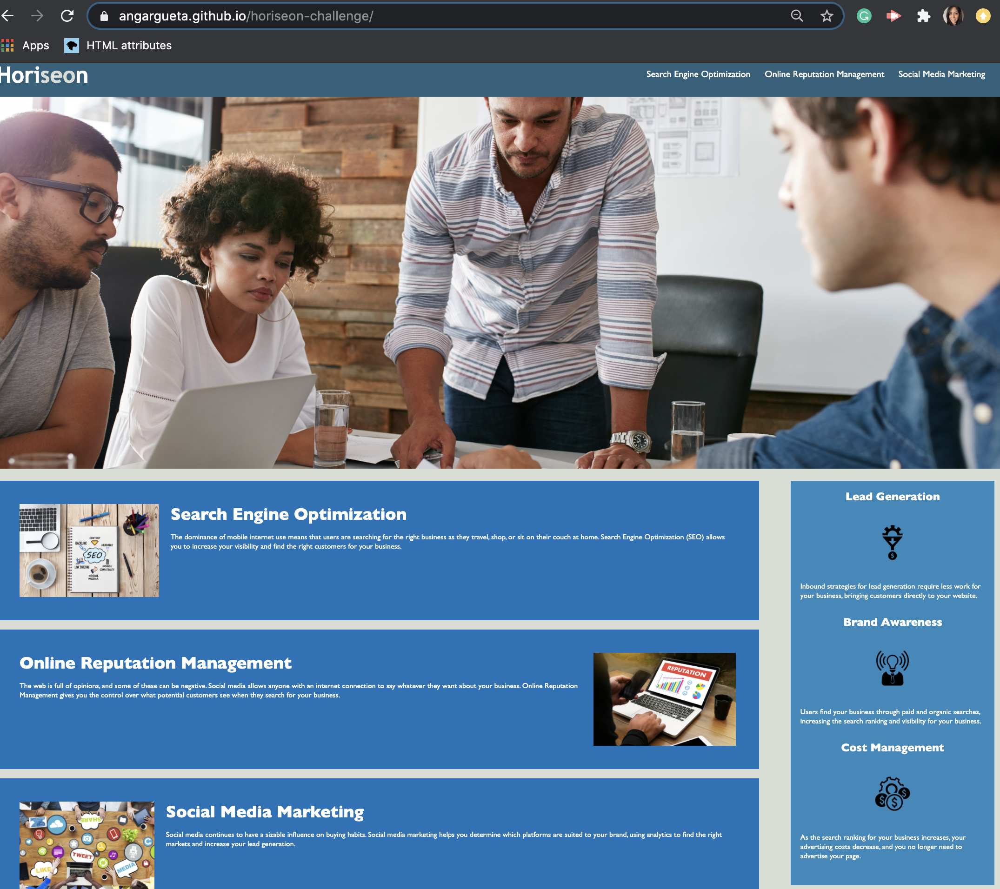

This challenge was created to refractor the code for a fake SEO company named, Horiseon. Horiseon is a marketing agency that has asked to codebase accessibility standards so that it is optimated for search engines. 

The requirements for this challenge were:
    <ul>
        <li>-to meet the accessibility standards</li>
        <li>contain semantic HTML elements</li>
        <li>elements that followed a logical structure independent of styling and positioning</li>
        <li>accessible alt attributes</li>
        <li>sequential heading attributes</li>
        <li>concise and descriptive title</li>
    </ul>

Mock up of the page:

URL link: https://angargueta.github.io/horiseon-challenge/
